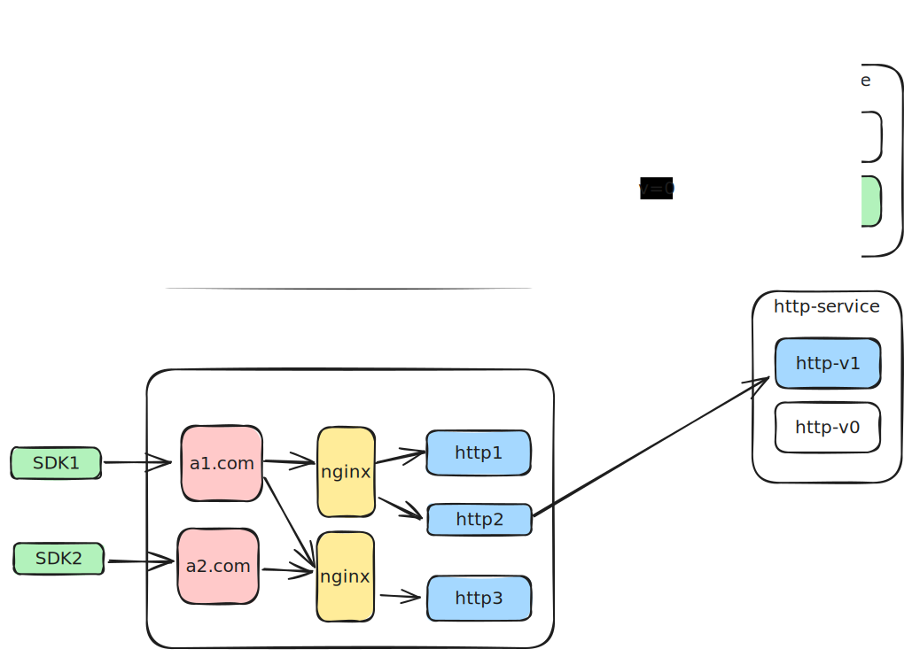
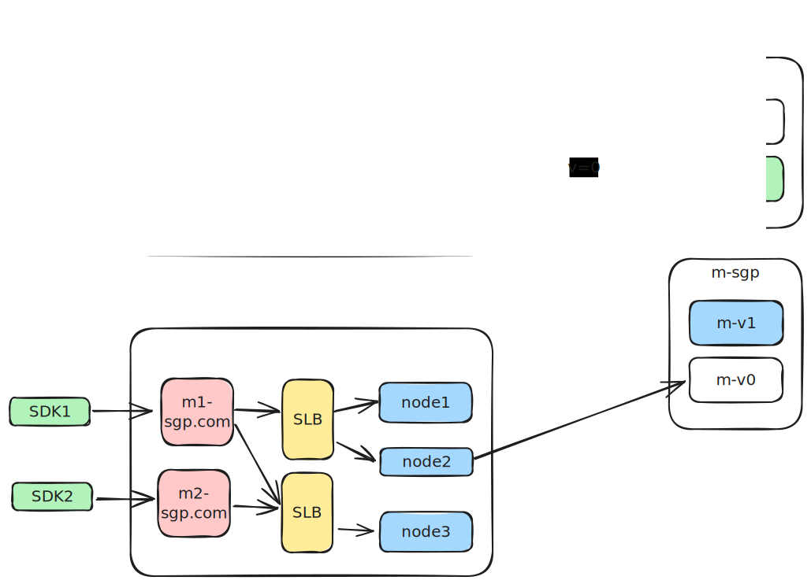

### 需求

- 重启时的配置更新：系统重启时从配置中心拉取最新配置
- 独立的配置更新：运行时动态更新单个服务的配置
- 灰度配置更新：**按照特定规则对服务实例进行配置更新**

### 服务当前部署情况

#### 不同服务的配置

<!-- SVG preview -->


<!-- Interactive Excalidraw link -->
[在 Excalidraw 中编辑](./config.excalidraw)

#### 不同集群的配置

<!-- SVG preview -->


<!-- Interactive Excalidraw link -->
[在 Excalidraw 中编辑](./config-cluster.excalidraw)


#### 集群灰度更新

<!-- SVG preview -->


<!-- Interactive Excalidraw link -->
[在 Excalidraw 中编辑](./config-gray.excalidraw)

### 设计方案

#### 1. Git仓库结构设计

```
config-repo/
├── m/
│   ├── application.properties         # 服务A的默认配置
│   ├── application-dev.properties     # 开发环境配置
│   ├── application-test.properties    # 测试环境配置
│   ├── application-gray.properties    # 测试环境配置
│   └── application-prod.properties    # 生产环境配置
└── http/
    ├── application.properties
    └── application-{profile}.properties
```

#### 2. 配置文件命名规则

- `{application}-{profile}.properties`: 服务特定配置
- `{application}.properties`: 服务默认配置

#### 3. 配置更新策略

##### 重启更新
- 服务启动时通过bootstrap配置指定配置中心地址
- 启动过程中自动从配置中心拉取最新配置

```yaml
spring:
  cloud:
    config:
      uri: http://config-server:8888
      name: ${spring.application.name}
      profile: ${spring.profiles.active}
```

##### 灰度更新

由于灰度更新是通过一个独立的配置文件进行配置，因此需要在服务启动时指定灰度配置文件，这里的profile的概念。

虽然灰度和其他的机器配置文件不同，但是提供的服务是相同的，所以在进行负载均衡时，需要将灰度机器和其他机器一起进行负载均衡，具体需要根据相应的负载均衡策略进行配置。


#### 4. 高可用设计

- Config Server集群化部署
- 本地配置缓存，防止配置中心不可用
